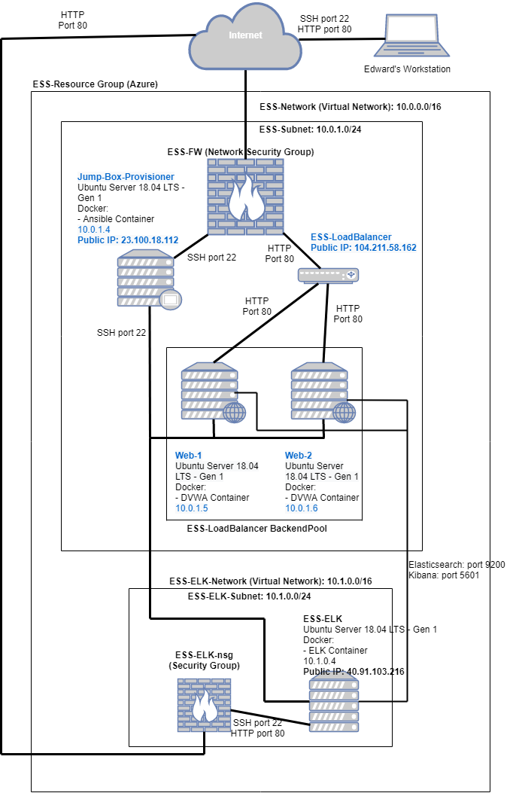
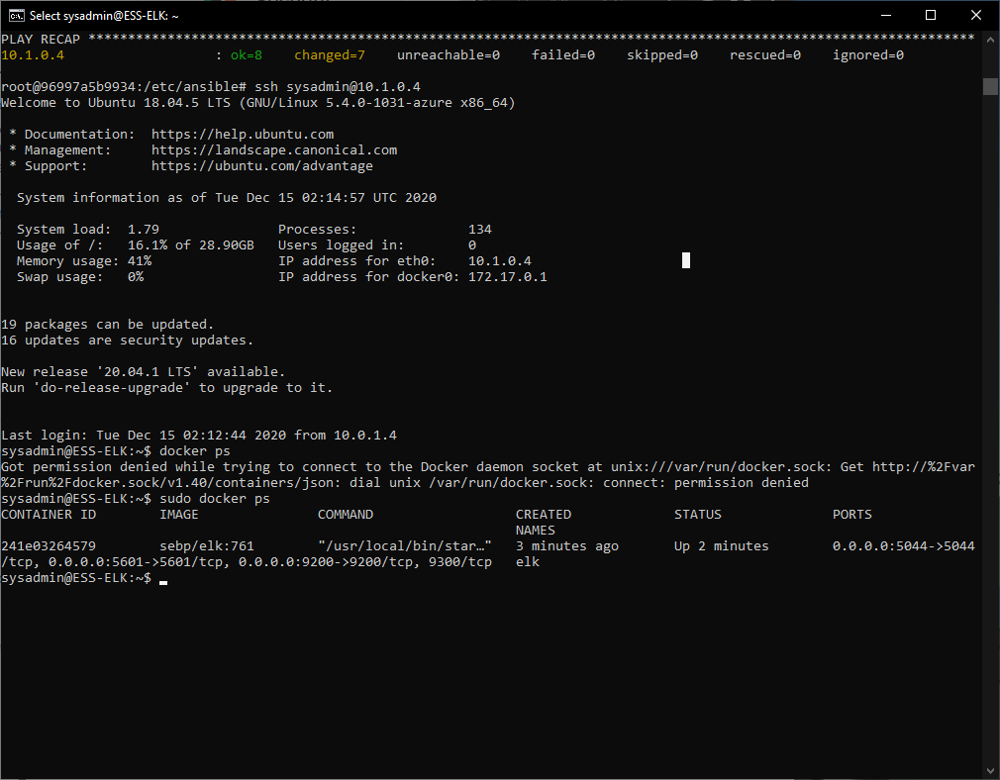
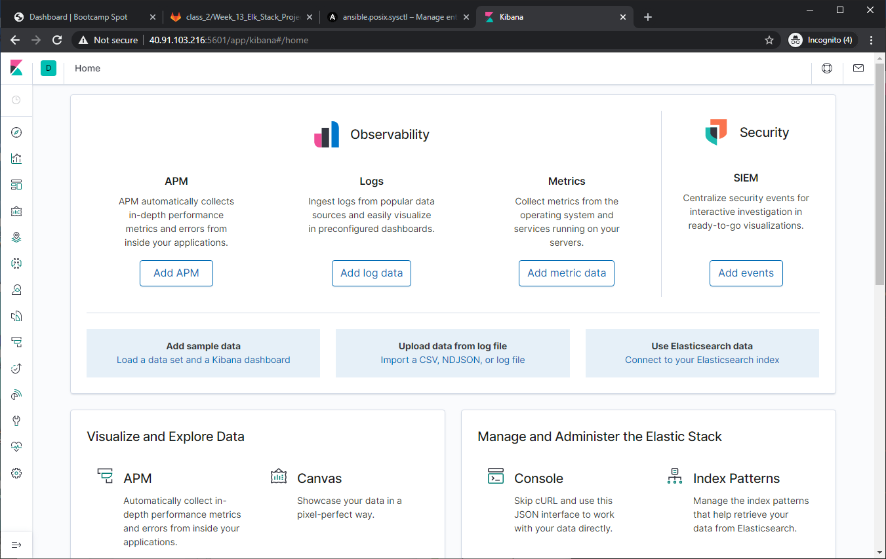

## Automated ELK Stack Deployment

The files in this repository were used to configure the network depicted below.



These files have been tested and used to generate a live ELK deployment on Azure. They can be used to either recreate the entire deployment pictured above. Alternatively, select portions of the __filebeat-config.yml__ file may be used to install only certain pieces of it, such as Filebeat.

This document contains the following details:
- Description of the Topology
- Access Policies
- ELK Configuration
  - Beats in Use
  - Machines Being Monitored
- How to Use the Ansible Build


### Description of the Topology

The main purpose of this network is to expose a load-balanced and monitored instance of DVWA, the D*mn Vulnerable Web Application.

Load balancing ensures that the application will be highly __available__, in addition to restricting __direct access__ to the network.

Integrating an ELK server allows users to easily monitor the vulnerable VMs for changes to the __logs__ and system __metrics__.

The configuration details of each machine may be found below.

| Name     | Function | IP Address | Operating System |
|----------|----------|------------|------------------|
| Jump-Box-Provisioner | Gateway | 23.100.18.112, 10.0.1.4 | Linux |
| ESS-LoadBalancer | Load Balancer | 104.211.58.162 | - |
| Web-1 | Web Server | 10.0.1.5 | Linux |
| Web-2 | Web Server | 10.0.1.6 | Linux |
| ESS-ELK | ELK Server | 40.91.103.216, 10.1.0.4 | Linux |

### Access Policies

The machines on the internal network are not exposed to the public Internet. 

Only the __Jump Box__ machine can accept connections from the Internet. Access to this machine is only allowed from the following IP addresses:

| IP Address | Machine ID |
|-------------|--------------|
| 99.229.18.174 | Personal Workstation |


Machines within the network can only be accessed by __ssh__.

The __ELK VM__ can be accessed by the above Personal Workstation, but only via TCP ports 5601, 9200, and 5044 for Kibana access.

A summary of the access policies in place can be found in the table below.

| Name     | Publicly Accessible | Allowed IP Addresses |
|----------|---------------------|----------------------|
| Jump Box | Yes | 99.229.18.174, 10.0.1.0/24 |
| Web-1 | No | 10.0.1.0/24 |
| Web-2 | No | 10.0.1.0/24 |
| ESS-ELK | Yes | 99.229.18.174, 10.0.0.0/15 |

### Elk Configuration

Ansible was used to automate configuration of the ELK machine. No configuration was performed manually, which is advantageous because if another ELK machine is needed for redundancy or replacement, the setup of the new machine can be done quickly by executing the Ansible playbook.

The playbook implements the following tasks:

- Install Docker
- Install Python3
- Configure VM to use maximum memory (RAM)
- Download, install, and launch Docker ELK container

The following screenshot displays the result of running `docker ps` after successfully configuring the ELK instance.



### Target Machines & Beats
This ELK server is configured to monitor the following machines:

| IP Address | Machine ID |
|-------------|--------------|
| 10.0.1.5 | Web-1 |
| 10.0.1.6 | Web-2 |

We have installed the following Beats on these machines:

- Filebeat
- Metricbeat

These Beats allow us to collect the following information from each machine:

- __Filebeat__ collects or harvests log data from files where it is directed to look. The harvested data is sent to a specified output that has been configured for Filebeat to display the information. For example, in the network we created, Filebeat harvests data from the access logs of Web-1 and Web-2, sends them to the ELK VM where Kibana indexes and displays the details.

- __Metricbeat__ collects metrics from the operating system and services running on a server. This data is then send to a specified output that has been configured for Metricbeat to display the information. For example, in the network we created, Metricbeat collects metrics from the OS and services running on Web-1 and Web-2, sends them to the ELK VM where Kibana indexes and displays the details.

### Using the Playbook
In order to use the playbook, you will need to have an Ansible control node already configured. Assuming you have such a control node provisioned: 

SSH into the control node and follow the steps below:
- Copy the __install-elk.yml__ Ansible playbook file to __/etc/ansible__.
- Update the __hosts__ file to include the __ELK VM__ by adding an `[elk]` group:
```bash
[elk]
<IP_address_of_ELK_VM> ansible_python_interpreter=/usr/bin/python3
```
- Run the playbook using the command `ansible-playbook install-elk.yml`.

- When the playbook execution is completed, navigate to the __ELM VM__ via SSH and ensure that the `sebp/elk:761` container is running by the command: `docker ps` to check that the installation worked as expected. (Screenshot shown earlier in __ELK Configuration__ section.)

- To verify the ELK server is running, navigate to http://[your.ELK-VM.External.IP]:5601/app/kibana. Use the public IP address of your new VM. The following page should display:


